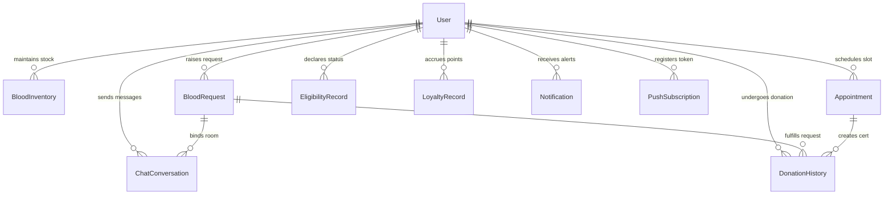

# BloodLink Technical Stack and Database Context Document

This document provides a comprehensive technical overview of the **BloodLink** application. It compiles architectural choices, codebase directory trees, full database schemas (for Entity-Relationship diagrams), API routes, WebSocket message events, and sequence flows. It is formatted to be parsed by LLMs (such as Claude, ChatGPT, or Gemini) to generate UML diagrams, technical specifications, and system architectures.

---

## 1. System Overview

**BloodLink** is a real-time, location-aware MERN stack application (MongoDB, Express.js, React, Node.js) paired with a React Native/Expo mobile app. The platform connects blood donors, hospitals/requesting clinics, and administrators to facilitate blood inventory management, emergency blood requests (SOS), appointment booking, and loyalty reward tracking.

### System Architecture
- **Web Frontend**: React 19 + Vite + Tailwind CSS v4.
- **Mobile App**: React Native (Expo SDK 54) supporting location tracking and native push notifications.
- **Backend API**: Node.js + Express.js serving REST APIs and managing socket connections.
- **Database**: MongoDB (NoSQL) with Mongoose ODM utilizing geographical queries (`2dsphere` indexes).
- **Real-Time Layer**: Socket.IO for immediate notification alerts, geolocation updates, and messaging.

---

## 2. Technical Stack Specifications

### 2.1 Backend Server (`/Server`)
- **Core Framework**: Express.js (v5.2.1)
- **Database driver**: Mongoose ODM (v9.6.2)
- **Security Middleware**:
  - `helmet`: HTTP headers protection (v8.1.0)
  - `express-rate-limit`: Basic rate limiter for API security (v8.5.1)
  - `express-mongo-sanitize`: Sanitizes input against MongoDB query injection (v2.2.0)
  - `bcryptjs`: Password hashing (v3.0.3)
  - `jsonwebtoken`: Stateless token authorization (v9.0.3)
- **Real-Time Capabilities**: Socket.IO (v4.8.3)
- **Background Tasks**: Node-cron (v4.2.1) for database maintenance (e.g., expiry checks)
- **Push Services**: `web-push` (v3.6.7) for web notifications, native Expo push integration for mobile.
- **Mail Services**: Nodemailer (v8.0.7) for OTP codes and account confirmation.

### 2.2 Web Frontend (`/Frontend`)
- **Build Tool**: Vite (v8.0.12)
- **Core Library**: React (v19.2.6) + React DOM (v19.2.6)
- **Styling**: Tailwind CSS (v4.3.0) + Tailwind Vite Plugin
- **Navigation**: React Router Dom (v7.15.1)
- **Forms and Validations**: React Hook Form (v7.76.0) + Yup / Resolvers (v1.7.1 / v5.2.2)
- **State & Data Fetching**: Axios (v1.16.1)
- **Visual Charts**: Recharts (v3.8.1) for admin analytics dashboards
- **Icons**: Lucide React (v1.14.0)
- **Real-Time Client**: Socket.IO Client (v4.8.3)

### 2.3 Mobile App (`/Mobile`)
- **Framework**: Expo (v54.0.0) / React Native (v0.81.5)
- **Storage**: AsyncStorage (v2.2.0) for auth token and server API URL configuration overrides
- **Permissions & Hardware APIs**:
  - `expo-location`: Geolocation queries and background tracking
  - `expo-notifications`: Local and remote push alerts
  - `expo-device` & `expo-constants`: Device characteristics identification
- **Networking & Sockets**: Socket.IO Client (v4.8.1)

---

## 3. Directory Structure

```text
Blood/
│
├── Server/                   # Backend Express/Node.js API Server
│   ├── config/               # Environment and DB config hooks
│   ├── controllers/          # Business logic handlers
│   ├── middlewares/          # JWT Auth, validation, rate limits
│   ├── models/               # Mongoose DB schemas (MongoDB models)
│   ├── routes/               # Express endpoint definitions
│   ├── utils/                # Cron tasks, Socket initialization, seeders
│   ├── server.js             # API entrypoint
│   └── package.json
│
├── Frontend/                 # React Web Application
│   ├── public/               # Static assets
│   ├── src/
│   │   ├── api/              # Axios configuration (axios.js)
│   │   ├── assets/           # Design assets, CSS, images
│   │   ├── components/
│   │   │   └── common/       # Nav, Sidebar, Badges, ProtectedRoutes
│   │   ├── context/          # Context Providers (SocketContext, Auth)
│   │   ├── pages/            # View pages divided by role
│   │   │   ├── admin/        # Admin dashboard, logs, analytics pages
│   │   │   ├── auth/         # Login, Register, Forgot Password
│   │   │   ├── donor/        # Eligibility, Appointments, Nearby Requests
│   │   │   ├── hospital/     # Blood stock, Raise requests, alerts
│   │   │   ├── public/       # Landing, About, Contact
│   │   │   └── shared/       # Conversations, ChatPage
│   │   ├── utils/            # Shared utilities (date formatting, ICS export)
│   │   ├── App.jsx           # App routing definitions
│   │   ├── main.jsx          # DOM Entry point
│   │   └── index.css         # Styling system
│   └── package.json
│
└── Mobile/                   # React Native (Expo) Mobile Application
    ├── src/
    │   ├── components/       # Custom buttons, lists, layout components
    │   ├── context/          # AppContext (global auth & server endpoint settings)
    │   ├── screens/          # Public and Role-based Screen files
    │   ├── styles/           # Global styles and themes
    │   └── utils/            # Async storage wrappers, helper functions
    ├── App.js                # App navigation root
    ├── app.json              # Expo configuration
    └── package.json
```

---

## 4. Database Schema Specification (for ER Diagrams)

The database runs on MongoDB. Relationships are managed via Mongoose ObjectIds referencing the `User` (and other) collections.

### 4.1 Schema Definitions

#### `User` (Collection: `users`)
Describes user accounts across all roles (Donor, Hospital, Admin).
```javascript
{
  firstName: { type: String, required: true, trim: true },
  lastName: { type: String, trim: true, default: "" },
  email: { type: String, required: true, unique: true, lowercase: true, trim: true },
  phoneNumber: { type: String, required: true, unique: true, trim: true },
  dob: { type: Date },
  bloodGroup: { type: String, enum: ["A+", "A-", "B+", "B-", "O+", "O-", "AB+", "AB-"] },
  password: { type: String, required: true },
  gender: { type: String, enum: ["Male", "Female", "Other", "male", "female", "other"] },
  city: { type: String, required: true, trim: true },
  address: { type: String },
  hospitalName: { type: String }, // Required/applicable only for Hospital role
  pincode: { type: String },
  licenseNumber: { type: String }, // Required/applicable only for Hospital/Org role
  registrationNumber: { type: String },
  emergencyContact: { type: String },
  age: { type: Number },
  role: { type: String, enum: ["donor", "hospital", "organization", "admin"], default: "donor" },
  isActive: { type: Boolean, default: true },
  isVerified: { type: Boolean, default: false }, // Email / Mobile Verification status
  isApproved: { type: Boolean, default: false }, // Admin approval for Hospitals
  isEligible: { type: Boolean, default: false }, // Donor Eligibility status
  suspensionReason: { type: String },
  points: { type: Number, default: 0 },
  totalDonations: { type: Number, default: 0 },
  badges: { type: [String], default: [] },
  location: {
    type: { type: String, enum: ["Point"], default: "Point" },
    coordinates: { type: [Number] } // [longitude, latitude]
  },
  resetPasswordToken: { type: String },
  resetPasswordExpire: { type: Date },
  profilePhoto: { type: String },
  expoPushToken: { type: String },
  timestamps: true // Creates createdAt and updatedAt
}
// Indexes:
// - location: "2dsphere" (For spatial distance queries)
```

#### `BloodInventory` (Collection: `bloodinventories`)
Maintains stock logs of blood units inside hospitals.
```javascript
{
  hospital: { type: ObjectId, ref: "User", required: true },
  bloodGroup: { type: String, enum: ["A+", "A-", "B+", "B-", "O+", "O-", "AB+", "AB-"], required: true },
  units: { type: Number, required: true, min: 0 },
  expiryDate: { type: Date, required: true },
  lastUpdated: { type: Date, default: Date.now }
}
// Indexes:
// - { hospital: 1, bloodGroup: 1 } (Unique configuration queries)
```

#### `BloodRequest` (Collection: `bloodrequests`)
Represents emergency SOS alerts or typical hospital blood requests.
```javascript
{
  requestedBy: { type: ObjectId, ref: "User", required: true },
  bloodGroup: { type: String, enum: ["A+", "A-", "B+", "B-", "O+", "O-", "AB+", "AB-"], required: true },
  unitsNeeded: { type: Number, required: true, min: 1 },
  urgency: { type: String, enum: ["normal", "urgent", "critical"], default: "normal" },
  status: { type: String, enum: ["open", "responding", "fulfilled", "cancelled"], default: "open" },
  notes: { type: String },
  location: {
    type: { type: String, enum: ["Point"], default: "Point" },
    coordinates: { type: [Number], required: true } // [longitude, latitude]
  },
  radiusKm: { type: Number, default: 10 },
  notifiedDonors: [{ type: ObjectId, ref: "User" }],
  respondingDonors: [
    {
      donor: { type: ObjectId, ref: "User" },
      action: { type: String, enum: ["accept", "decline"] },
      respondedAt: { type: Date, default: Date.now }
    }
  ],
  acceptedDonor: { type: ObjectId, ref: "User" }, // Donor who is currently handling this request
  fulfilledAt: { type: Date }
}
// Indexes:
// - location: "2dsphere"
```

#### `Appointment` (Collection: `appointments`)
Manages donor appointments scheduled at specific hospitals.
```javascript
{
  donor: { type: ObjectId, ref: "User", required: true },
  hospital: { type: ObjectId, ref: "User", required: true },
  date: { type: Date, required: true },
  timeSlot: { type: String, required: true },
  status: { type: String, enum: ["scheduled", "completed", "cancelled"], default: "scheduled" }
}
```

#### `DonationHistory` (Collection: `donationhistories`)
Maintains historical, certified donation records.
```javascript
{
  donor: { type: ObjectId, ref: "User", required: true },
  hospital: { type: ObjectId, ref: "User", required: true },
  bloodGroup: { type: String, enum: ["A+", "A-", "B+", "B-", "O+", "O-", "AB+", "AB-"], required: true },
  units: { type: Number, default: 1 },
  donationDate: { type: Date, default: Date.now },
  certificateId: { type: String, unique: true, required: true },
  bloodRequest: { type: ObjectId, ref: "BloodRequest", unique: true, sparse: true },
  appointment: { type: ObjectId, ref: "Appointment", unique: true, sparse: true },
  source: { type: String, enum: ["appointment", "sos", "manual"], default: "manual" },
  notes: { type: String }
}
```

#### `EligibilityRecord` (Collection: `eligibilityrecords`)
Saves multi-step eligibility check submissions by donors.
```javascript
{
  donor: { type: ObjectId, ref: "User", required: true },
  age: { type: Number },
  weight: { type: Number },
  recentIllness: { type: Boolean },
  medications: { type: Boolean },
  travelHistory: { type: Boolean },
  tattooPiercing: { type: Boolean },
  hemoglobin: { type: Number },
  gender: { type: String },
  status: { type: String, enum: ["eligible", "temporarily_deferred", "permanently_deferred"], required: true },
  deferralReason: { type: String },
  deferralUntil: { type: Date, default: null },
  createdAt: { type: Date, default: Date.now }
}
```

#### `LoyaltyRecord` (Collection: `loyaltyrecords`)
Tracks point accrual logs for donation-related badges.
```javascript
{
  donor: { type: ObjectId, ref: "User", required: true },
  action: { type: String, required: true }, // e.g., "donation_completed", "sos_accepted"
  points: { type: Number, default: 0 },
  description: { type: String },
  createdAt: { type: Date, default: Date.now }
}
```

#### `Notification` (Collection: `notifications`)
In-app message storage.
```javascript
{
  recipient: { type: ObjectId, ref: "User", required: true },
  type: { type: String, required: true }, // e.g., "emergency_sos", "donation_reminder", "broadcast"
  title: { type: String, required: true },
  message: { type: String, required: true },
  data: { type: Schema.Types.Mixed, default: {} }, // Arbitrary payload payload (e.g., { requestId })
  isRead: { type: Boolean, default: false }
}
```

#### `PushSubscription` (Collection: `pushsubscriptions`)
Web push subscription storage (VAPID key endpoints).
```javascript
{
  user: { type: ObjectId, ref: "User", required: true },
  subscription: {
    endpoint: { type: String, required: true, unique: true },
    keys: {
      p256dh: { type: String, required: true },
      auth: { type: String, required: true }
    }
  },
  createdAt: { type: Date, default: Date.now }
}
```

#### `ChatConversation` (Collection: `chatconversations`)
Details room details and embedded messages between requester and donor.
```javascript
{
  request: { type: ObjectId, ref: "BloodRequest", required: true, unique: true },
  requester: { type: ObjectId, ref: "User", required: true }, // Renamed from 'hospital' to support both hospital and donor SOS
  donor: { type: ObjectId, ref: "User", required: true },
  messages: [
    {
      sender: { type: ObjectId, ref: "User", required: true },
      message: { type: String, required: true, trim: true, max: 1000 },
      createdAt: { type: Date, default: Date.now },
      readBy: [{ type: ObjectId, ref: "User" }]
    }
  ]
}
// Indexes:
// - { requester: 1, donor: 1 }
```

---

### 4.2 Entity-Relationship (ER) Diagram (Mermaid Representation)



---

## 5. Backend API Catalog (Routing Map)

All routes are prefixed with `/api`. Authenticated routes expect a `Bearer <token>` HTTP Header parsed by the JWT auth middleware.

| Module | Method | Endpoint | Auth | Role Required | Purpose |
| :--- | :--- | :--- | :--- | :--- | :--- |
| **Auth** | `POST` | `/auth/signup` | No | Any | Register user account (OTP checked) |
| | `POST` | `/auth/login` | No | Any | Authenticate & retrieve JWT |
| | `POST` | `/auth/send-otp` | No | Any | Generate and email OTP verification code |
| | `POST` | `/auth/verify-otp` | No | Any | Validate correctness of active OTP |
| | `GET` | `/auth/me` | Yes | Any | Retrieve profile data of logged-in user |
| | `PUT` | `/auth/me` | Yes | Any | Update profile details (except credentials) |
| | `POST` | `/auth/forgot-password`| No | Any | Trigger password reset email with reset token |
| | `POST` | `/auth/reset-password` | No | Any | Accept token and apply new password |
| **Eligibility** | `GET` | `/eligibility/status` | Yes | donor | Fetch latest questionnaire screening status |
| | `POST` | `/eligibility/check` | Yes | donor | Screen donor questionnaire & update status |
| **Loyalty** | `GET` | `/loyalty/my-stats` | Yes | donor | Fetch points ledger and unlocked badges |
| | `GET` | `/loyalty/leaderboard` | Yes | donor | Fetch top donors by points accumulation |
| **Donations** | `GET` | `/donations/my-history` | Yes | donor | Retrieve all certified donations of donor |
| **Appointments**| `GET` | `/appointments` | Yes | Any | List appointments (role filtered) |
| | `POST` | `/appointments` | Yes | donor | Book appointment slot at select hospital |
| | `PUT` | `/appointments/:id/complete`| Yes| hospital | Record completed donation via appointment |
| **Inventory** | `GET` | `/inventory` | Yes | hospital | Retrieve current hospital blood inventory |
| | `POST` | `/inventory` | Yes | hospital | Add or update inventory stock units |
| | `DELETE`| `/inventory/:id` | Yes | hospital | Discard expired or manually cleared stock |
| | `GET` | `/inventory/expiry-alerts`| Yes| hospital | Retrieve blood stock expiring within 7 days |
| **Blood Requests**| `GET` | `/blood-requests` | Yes | hospital / donor| List raised requests by issuer or accepted |
| | `GET` | `/blood-requests/nearby`| Yes| donor | Search active requests in radius (GeoQuery) |
| | `POST` | `/blood-requests` | Yes | hospital / donor| Create emergency request & alert donors |
| | `PUT` | `/blood-requests/:id/respond`| Yes| donor | Accept or decline an emergency request alert |
| | `PUT` | `/blood-requests/:id/status`| Yes | hospital / donor| Update request status (e.g. cancel) |
| | `PUT` | `/blood-requests/:id/complete-donation`| Yes| hospital | Close request, log points, and defer donor |
| **Notifications**| `GET` | `/notifications` | Yes | Any | List unread and read in-app alerts |
| | `PUT` | `/notifications/read-all`| Yes| Any | Mark all user alerts read |
| | `PUT` | `/notifications/:id/read`| Yes| Any | Mark single alert read |
| | `DELETE`| `/notifications/:id` | Yes | Any | Delete single notification |
| | `DELETE`| `/notifications/all` | Yes | Any | Clear notifications feed |
| **Donors** | `GET` | `/donors/search` | Yes | hospital | Search donors matching group and city |
| | `GET` | `/donors/count` | Yes | hospital / donor| Fetch count of eligible location matched donors |
| | `PUT` | `/donors/location` | Yes | donor | Update donor's latest geographic coordinates |
| **Hospitals** | `GET` | `/hospitals/list` | Yes | donor | Fetch approved hospitals for appointments |
| **Chat** | `GET` | `/chats` | Yes | Any | List conversations for the logged-in user |
| | `GET` | `/chats/:requestId` | Yes | Any | Retrieve message list for request room |
| | `POST` | `/chats/:requestId/messages`| Yes| Any | Append message to active conversation |
| **Admin** | `GET` | `/admin/stats` | Yes | admin | Fetch overall user, stock and system counts |
| | `GET` | `/admin/users` | Yes | admin | Query, filter and search users by details |
| | `PUT` | `/admin/users/:id/approve`| Yes| admin | Review and approve hospital credentials |
| | `PUT` | `/admin/users/:id/suspend`| Yes| admin | Suspend user account and write reason log |
| | `PUT` | `/admin/users/:id/activate`| Yes| admin | Re-enable user access status |
| | `GET` | `/admin/requests` | Yes | admin | Fetch system-wide emergency request log |
| | `GET` | `/admin/inventory` | Yes | admin | View aggregated inventory counts by blood type |
| | `GET` | `/admin/analytics` | Yes | admin | Retrieve system analytics data |
| | `POST` | `/admin/broadcast` | Yes | admin | Dispatch alert notification to target cohorts |

---

## 6. WebSocket Protocol & Event Mapping

Socket.IO is configured in `/Server/utils/realtime.js` and parsed in the React frontend in `/Frontend/src/context/SocketContext.jsx`. The connection matches client socket ID to authenticated user IDs to route targeted socket alerts.

### 6.1 Server-Side Events (Listen & Emit)
- **`connection`**: Triggered when client logs in/connects. Authenticated client joins user room: `socket.join(userId)`.
- **`request:join`**: Triggered when client opens ChatPage. Joins the dedicated request conversation room: `socket.join(requestId)`.
- **`blood-request:new`**: Emitted from backend to a list of compatible, nearby donors (coordinates check) when a new emergency SOS request is created.
- **`blood-request:closed`**: Emitted to all notified donors when another donor has already accepted the emergency request.
- **`blood-request:response`**: Emitted to the requester user room (hospital or donor) indicating a donor accepted/declined.
- **`chat:ready`**: Emitted to both accepted donor and requester when the conversation database instance gets generated upon donor accept.
- **`chat:message`**: Emitted to the `requestId` room when a message gets successfully saved to the database.
- **`chat:unread`**: Emitted to specific participant if they are not in the room when a new message is posted.
- **`eligibility:deferred`**: Emitted to donor when their status shifts to deferred (e.g. right after a completed donation is recorded).
- **`donation:recorded`**: Triggered on hospital recording donation, alerting donor that points are added.

---

## 7. Critical Workflow Sequence Diagrams

### 7.1 Emergency SOS / Request Cycle
How a hospital or donor raises an SOS request, alerts nearby donors, gets accepted, and begins chat.

```mermaid
sequenceDiagram
    autonumber
    actor Requester as Hospital / SOS Donor
    participant API as Backend Express Server
    database DB as MongoDB
    actor Donor as Nearby Eligible Donor

    Requester->>API: POST /api/blood-requests { group, location, radius, units }
    API->>DB: Find eligible users within distance coordinates
    DB-->>API: Return matched user array
    API->>DB: Save BloodRequest with status: 'open'
    API->>API: Create notifications for matched users
    API->>Donor: Socket Emit "blood-request:new" { requestDetails }
    Donor->>API: PUT /api/blood-requests/:id/respond { action: "accept" }
    
    note over API, DB: Atomic findOneAndUpdate check ensures status is still 'open' and acceptedDonor is null
    API->>DB: Update acceptedDonor & status = 'responding'
    API->>DB: Create ChatConversation { request, requester, donor }
    API-->>Donor: Return success (status: 200)
    
    API->>Requester: Socket Emit "blood-request:response" & "chat:ready" { chatId }
    API->>Donor: Socket Emit "chat:ready" { chatId }
    API->>Donor: Socket Emit "blood-request:closed" to all OTHER notified donors
```

### 7.2 Donation Completion and Eligibility Deferral
How hospital logs completion, triggers status update, and how donor UI updates automatically.

```mermaid
sequenceDiagram
    autonumber
    actor Hospital as Hospital User
    participant API as Backend Express Server
    database DB as MongoDB
    actor Donor as Accepted Donor

    Hospital->>API: PUT /api/blood-requests/:id/complete-donation
    API->>DB: Update BloodRequest status to 'fulfilled'
    API->>DB: Update User (donor) points (+100) & totalDonations (+1)
    
    note over API, DB: Eligibility updates: sets isEligible = false
    API->>DB: Create EligibilityRecord status: 'temporarily_deferred'
    API->>DB: Save deferralUntil date (current date + 30 days)
    
    API->>Donor: Socket Emit "eligibility:deferred" { deferralUntil }
    note over Donor: SocketContext captures event
    Donor->>Donor: Trigger UI re-fetch / update components in real-time
    API-->>Hospital: Return 200 (Success)
```

---

## 8. UML & ER Diagram Generation Instructions for Claude

When pasting this file into Claude or ChatGPT to generate diagrams, use the following prompts:

### 8.1 For Generating a PlantUML Database Entity Relationship (ER) Diagram
> "Based on the database schema definitions in Section 4.1 of this document, generate a complete PlantUML Entity Relationship diagram. Write out all entity attributes with their datatypes (e.g., String, Number, Boolean, Date, ObjectId) and specify primary keys (like `_id`) and relational foreign keys using standard Crow's Foot relationship notations (e.g., `User ||--o{ BloodRequest`). Use descriptive labels on relation links."

### 8.2 For Generating a PlantUML Class Diagram of the Controllers and Models
> "Generate a UML Class Diagram in PlantUML matching the server architecture of this BloodLink application. Create classes representing each Model (User, BloodRequest, ChatConversation, etc.) and write their internal property names. Additionally, write classes for the corresponding controllers showing public endpoint handlers (e.g. `authController` with `signup`, `login`, `sendOtp`; `bloodRequestController` with `createRequest`, `respondToRequest`, `completeDonation`). Connect controllers to models they manipulate."

### 8.3 For Generating a Mermaid Class Diagram of the Frontend State and Layout
> "Using Section 2.2 and Section 3, generate a Mermaid class diagram representing the React Web architecture. Show how `App.jsx` handles routing, how context providers (`SocketContext`, `AuthContext`) wrap the layout, and how the main dashboards (`DonorDashboard`, `HospitalDashboard`, `AdminDashboard`) render child components and invoke the Axios client layer to hit API endpoints."
